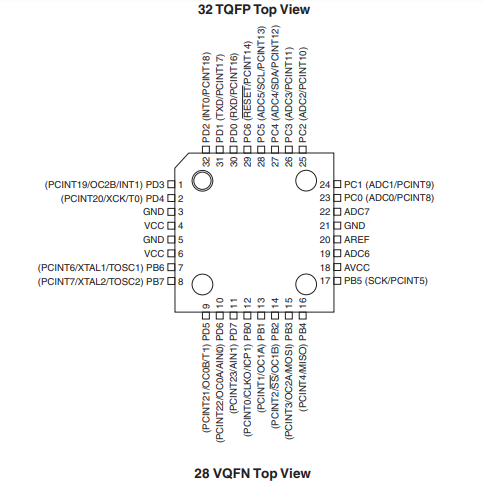

# M32CTV

Aquí hay código para automatizar el encendido/apagado de algunos dispositivos usados en invernaderos. Se usa un microcontrolador de 8 bits cargado con el bootloader de Arduino, comunicación inalámbrica via UART y algo de electrónica para activar los relevadores para una bomba de riego, ventiladores y/o extractores, y lámparas de cutivo. <b>Este repo se está construyendo.</b>

 

 

## 1. DESCRIPCIÓN DE LOS COMPONENTES

Los invernaderos ofrecen muchas ventajas sobre los métodos de agricultura tradicionales. El cultivo en la ciudad de algunas plantas y hortalizas es más común actualmente. La tecnología usada en la agricultura protegida también se puede adaptar a espacios dedicados en la ciudad. Esta tecnología puede incluir la automatización de tareas y control de parámetros; medición/control de humedad, temperatura, PH. Automatización de riego, ventilación, fotoperiodo, etc.
 
text

## 2. TEMA 2
## 3. TEMA 3

