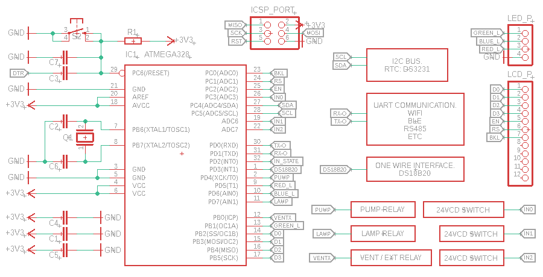

# M32CTV

Aquí hay código para automatizar el encendido/apagado de algunos dispositivos usados en invernaderos. Se usa un microcontrolador de 8 bits cargado con el bootloader de Arduino, comunicación inalámbrica via UART, temporización con un RTC y algo de electrónica para activar los relevadores para una bomba de riego, ventiladores y/o extractores, y lámparas de cutivo. <b>Este repo se está construyendo.</b>

 

 

## 1. DESCRIPCIÓN DE LOS COMPONENTES

Los invernaderos ofrecen muchas ventajas sobre los métodos de agricultura tradicionales. En la ciudad el cultivo de algunas plantas y hortalizas es más común actualmente y la tecnología usada en la agricultura protegida también se puede adaptar a espacios dedicados en la ciudad. Esta tecnología puede incluir la automatización de tareas como el riego, ventilación/extracción, luz (fotoperiodo) y medición de parámetros como temperatua, humedad, PH, etc.

 

<ul>
 <li align="justify"><b>Luz.</b> El sol es una gran fuente de energía e influye directamente en el desarrollo de los seres vivos. Hoy existen lámparas de cultivo que emulan la radiación solar, algunas usan los colores rojo y azul principalmente. Se dispone de 1 pin digital del microcontrolador para el control de una lámpara en CA.</li> 
<table align="center">
  <tr>
    <th>Led rojo/azul.</th>
    <th>Led blanco.</th>
    <th>Otras lámparas.</th>
  </tr>
  <tr>
    <td align="center"></td>
    <td align="center"></td>
    <td align="center"></td>
  </tr>
</table>
 <li align="justify"><b>Riego.</b> Existen diferentes sistemas de riego y se debe a las multiples variables de un cultivo. Podemos mencionar algunos como: asperción, goteo, por gravedad, nft, entre otros.  Se dispone de 1 pin digital del microcontrolador para el control de una bomba de agua en CA.</li>
 <li align="justify"><b>Ventilación/extracción.</b> Algunas veces es necesario hacer circular aire en los invernaderos, con la finalidad de mantener una temperatura uniforme o eliminar el aire viciado. Se dispone de 1 pin digital del microcontrolador para el control de un ventilador y/o extractor en CA.</li>
</ul>

## 2. TARJETA DE CONTROL

Aquí se documentará sobre la tarjeta de control propuesta.

## 3. INSTALACIÓN ELÉCTRICA

Aquí se documentará sobre la instalación eléctrica propuesta.

