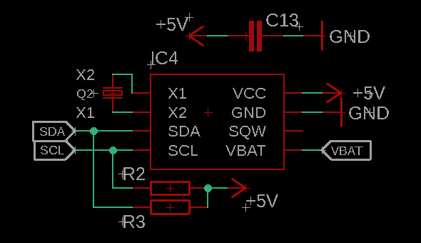

# M32CTV

Aquí hay código para automatizar el encendido/apagado de algunos dispositivos usados en invernaderos. Se usa un Atmega328p cargado con el bootloader de Arduino, comunicación inalámbrica via UART, temporización con un RTC y algo de electrónica para activar contactores de una bomba de riego, ventiladores y/o extractores, y lámparas de cutivo.

 

 

## 1. COMPONENTES

Los invernaderos ofrecen muchas ventajas sobre los métodos de agricultura tradicionales. El cultivo de algunas plantas y hortalizas puede adaptarse a espacios dedicados en la ciudad. La tecnología usada en la agricultura protegida también se puede adaptar a estos lugares y puede contemplar la automatización de tareas como el riego, la ventilación y/o extracción de aire, control de fotoperiodo y también la medición de parámetros como temperatura, humedad, PH, etc.

 

<ul>
 <li align="justify"><b>Luz.</b> El sol como fuente de energía es una muy potente e influye directamente en el desarrollo de vida. Dentro del espectro de radiación solar encontramos la radiación fotosintéticamente activa, donde los tonos azules y rojos son los más influyentes en el desarrollo de las plantas. La tecnología LED en la actualidad ofrece alternativas para suministro de luz en los cultivos. Se dispone de <b>1 pin digital</b> del microcontrolador para el control de una lámpara en CA.</li> 
<table align="center">
  <tr>
    <th>Led rojo/azul.</th>
    <th>Led blanco.</th>
    <th>Otras lámparas.</th>
  </tr>
  <tr>
    <td align="center"></td>
    <td align="center"></td>
    <td align="center"></td>
  </tr>
</table>

  <li align="justify"><b>Riego.</b> Hay diferentes métodos de riego en la agricultura y se pueden mencionar algunos como: riego por asperción, por goteo, por gravedad, película de nutrientes, entre otros. Se hace la generalización de controlar el encendido/apagado de una bomba de agua o una electroválvula para realizar esta tarea.<b> Se dispone de 1 pin digital para el control.</b>  
  </li> 

  

 <table align="center">
  <tr>
    <th>Goteo.</th>
    <th>Gravedad.</th>
    <th>Película de nutrientes.</th>
   <th>Válvula E.</th>
  </tr>
  <tr>
    <td align="center"></td>
    <td align="center"></td>
    <td align="center"></td>
    <td align="center"></td>
  </tr>
</table>
  <li align="justify"><b>Ventilación/extracción.</b> La calidad del aire de los espacios de cultivo influye en la temperatura y por lo tanto en el desarrollo de las plantas. Si es necesario forzar la cirulación aire limpio en los invernaderos y eliminar el aire viciado se incluyen equipos de extracción, ventilación y algunas veces calefacción.<b>Se dispone de 1 pin digital del microcontrolador</b> para el control de un ventilador y/o extractor en CA.
  </li>
</ul>

## 2. TARJETA DE CONTROL

El microcontrolador <a href="https://ww1.microchip.com/downloads/en/DeviceDoc/ATmega48A-PA-88A-PA-168A-PA-328-P-DS-DS40002061B.pdf">Atmega328p</a> de Microchip/Atmel es un dispositivo de 8 bits con arquitectura RISC. Cuenta con una memoria de programa de 32 KBytes, 1 KBytes en EEPROM, tiene hasta 23 pines que se pueden configurar como salidas o entradas y puede trabajar desde 1.8 volts hasta 5.5 volts. Algunas características usadas en este proyecto son; I2C, UART, salidas PWM y un bloque de salidas digitales para los actuadores. Se usa el bootloader de la tarjeta Arduino UNO.
 
<ul>
<li align="justify"><b>Salidas digitales.</b>
Se ocupan 3 salidas digitales para la activación de los dispositivos mencionados (lámpara, bomba de agua y ventilador/extractor). Las salidas del mcu están conectadas individualmente a un SSR <a href="https://b2b-api.panasonic.eu/file_stream/pids/fileversion/2787">AQH2213</a> con un circuito de proteccion sugerido por el fabricante para cargas inductivas como lo es la bobina de los contactores.
 
 

 
<table align="center">
  <tr>
    <th>Diagrama típico de conexión.</th>
    <th>Diagrama de conexión final.</th>
  </tr>
  <tr>
    <th></th>
    <th></th>
  </tr>
  </table>

 

</li>
 
<li align="justify"><b>Real Time Clock.</b>
Para temporizar el encendido y apagado que deben tener los equipos, se usa un <a href="https://datasheets.maximintegrated.com/en/ds/DS1307.pdf">RTC</a> a través de la interface serial I2C. Nuestro dispositivo maestro, realizará lecturas del RTC en el bucle principal y dependiendo de las variables de apagado de cada dispositivo, se procederá a activar o desactivar las salidas correspondientes.
 
 

 
<table align="center">
  <tr>
    <th>Diagrama típico de conexión.</th>
    <th>Diagrama de conexión final.</th>
  </tr>
  <tr>
    <th></th>
    <th></th>
  </tr>
  </table>

 

</li>
 
<li align="justify"><b>Comunicación inalámbrica.</b>
La interface USART nos permite hacer comunicaciones con implementaciones como WIFI, BLE, GSM, otros tipos de RF, estándares como RS485, RS232, también se puede adaptar a CAN y LIN. Se usa esta interface para hacer una comunicación via BLE, la cual nos permitirá actualizar las variables del cultivo.
 
 

 

</li>
 
<li align="justify"><b>Salidas PWM.</b>
La modulación por ancho de pulso es una técnica eléctronica que se aplica principalmente para el control de potencia.
</li>
 
</ul>

## 3. INSTALACIÓN ELÉCTRICA

Aquí se documentará sobre la instalación eléctrica propuesta.
 

<ul>
<li>Contactores.</li>
<li>Interruptores Termomagnéticos.</li>
<li>Diagrama Eléctrico.</li>
</ul>
